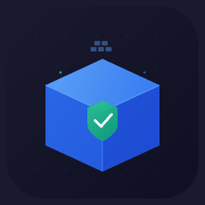

<p align="center">
  
</p>

# Claude Sandbox

A lightweight Docker sandbox for development — drop into an isolated shell at your current directory with all your host tools available. Optionally run [Claude Code](https://docs.anthropic.com/en/docs/claude-code) with `--dangerously-skip-permissions` inside the container where the blast radius is limited by Docker.

## Why?

- **Sandboxed shell** — work inside a disposable container, not directly on your host
- **Seamless auth** — shares your SSH keys (read-only), git config, AWS credentials, and Claude session
- **Cross-platform** — works on Linux, WSL2, and macOS (including Apple Silicon)

## Requirements

| Platform | Requirements |
|----------|-------------|
| **Linux / WSL2** | Docker, [Claude Code](https://docs.anthropic.com/en/docs/claude-code) on the host |
| **macOS** | Docker Desktop |

On Linux/WSL2, host binaries are mounted directly into the container (zero build time). On macOS, a Docker image is built with Claude and Docker CLI pre-installed (one-time build, then cached).

## Quick Start

### 1. Install

```bash
git clone git@github.com:aeanez/claude-sandbox.git
cd claude-sandbox
make install
```

The installer auto-detects your shell (`bash`/`zsh`) and platform. On macOS it builds the sandbox image during install.

```bash
source ~/.bashrc   # or: source ~/.zshrc on macOS
```

### 2. Use

```bash
# Open an interactive shell inside the sandbox
sandbox

# Run Claude Code with --dangerously-skip-permissions inside the sandbox
yolo
```

## Commands

| Command | Description |
|---------|-------------|
| `sandbox` | Opens an interactive bash shell inside the container at your current directory |
| `sandbox ls` | Lists all running sandbox containers |
| `sandbox stop` | Stops all running sandbox containers |
| `sandbox exec <cmd>` | Runs a one-off command inside a new container |
| `sandbox attach` | Attaches to a running container for the current directory |
| `sandbox help` | Shows help |
| `yolo` | Runs `claude --dangerously-skip-permissions` inside the container — resumes the last session if one exists, otherwise starts fresh (hostname: `yolo`) |
| `yolonew` | Same as `yolo` but always starts a fresh session |

### Makefile targets

| Target | Description |
|--------|-------------|
| `make install` | Install claude-sandbox into your shell rc file |
| `make uninstall` | Remove claude-sandbox from your shell rc file |
| `make build` | Build the macOS Docker image (macOS only, skipped on Linux) |
| `make rebuild` | Rebuild the image from scratch — no cache (macOS only) |
| `make status` | Show image info and running containers |

### Container lifecycle

Stale containers are automatically cleaned up. Every `sandbox` or `yolo` launch prunes any exited sandbox containers. Containers run with `--init` (tini) so signals are properly forwarded when terminals disconnect (e.g., VS Code reloads). Use `sandbox ls` to see what's running and `sandbox stop` to clean up everything.

## How is this different from Claude Code's `/sandbox`?

Claude Code has a built-in `/sandbox` command that uses OS-level isolation (bubblewrap on Linux, Seatbelt on macOS) to restrict what individual tool calls can access. It's a security feature that limits filesystem writes and filters network requests.

This repo is different — it wraps your **entire session** inside a Docker container:

| | Claude Code `/sandbox` | claude-sandbox (this repo) |
|---|---|---|
| **Scope** | Restricts individual Bash commands | Isolates the entire session |
| **Technology** | OS-level (bubblewrap / Seatbelt) | Docker container |
| **Filesystem** | Write-restricted to CWD + allowlist | Container boundary — only sees mounted paths |
| **Network** | Proxy-based domain allowlist | Host network (no filtering) |
| **Tools** | Some break (docker, watchman) | All host binaries available |
| **Use case** | Hardened security for autonomous agents | Dev workflow with full autonomy (`yolo`) |

The main value of `yolo` is running `--dangerously-skip-permissions` inside a disposable container where the blast radius is limited by Docker. You can also enable `/sandbox` *inside* the container for defense-in-depth.

## How It Works

### Linux / WSL2

Host binaries and libraries are mounted directly into the container — zero build time, instant startup. The container's `$HOME` is backed by a **tmpfs overlay** so writes outside the explicit mount list never leak back to your host home.

```
Host (WSL2 / Linux)
 |
 ├── $HOME                      ──► tmpfs overlay (isolates writes from host $HOME)
 │    ├── .ssh                  ──► read-only (SSH keys)
 │    ├── .aws                  ──► read-write (SSO token refresh works inside)
 │    ├── .gnupg                ──► read-only (GPG keys for commit signing)
 │    ├── .gitconfig            ──► read-only (git identity + aliases)
 │    ├── .claude               ──► read-write (Claude session, memory, plugins)
 │    ├── .claude.json          ──► read-write (onboarding/theme state)
 │    ├── .local/bin            ──► read-only (user-installed CLIs like glab)
 │    ├── .local/share/claude   ──► read-only (Claude install tree)
 │    ├── .config/glab-cli      ──► read-write (OAuth token refresh — if present)
 │    ├── .config/acli          ──► read-write (jira/acli auth state — if present)
 │    ├── .bashrc               ──► read-only (if present — env, aliases, tool init)
 │    ├── .profile              ──► read-only (if present)
 │    ├── .nvm                  ──► read-only (if present — host-installed Node)
 │    └── .cargo                ──► read-only (if present — Rust toolchain)
 ├── $PWD                       ──► read-write (your project directory)
 ├── /tmp                       ──► read-write (shared — files persist to host)
 ├── /usr/bin                   ──► read-only (host binaries)
 ├── /usr/lib                   ──► read-only (shared libraries)
 ├── /usr/local                 ──► read-write (extra tooling like AWS CLI)
 ├── /usr/share                 ──► read-only (ca-certificates, TLS roots)
 ├── /lib/x86_64-linux-gnu      ──► read-only (shared libraries)
 ├── /etc                       ──► read-only (uid resolution + TLS config)
 ├── docker binary              ──► read-only (resolved via readlink for WSL)
 └── /var/run/docker.sock       ──► read-write (Docker-in-Docker)
         │
         ▼
   ┌────────────────────────────────────────────┐
   │  ubuntu:22.04 container (~70MB)            │
   │                                            │
   │  • Same uid/gid as host (--user)           │
   │  • --group-add <docker.sock gid>           │
   │  • Host network mode (--network host)      │
   │  • Working dir = host $PWD                 │
   │  • --init (tini) + --rm (auto-cleanup)     │
   │  • Container name: claude-<mode>-<md5pwd>  │
   └────────────────────────────────────────────┘
```

**Conditional mounts** (`.config/glab-cli`, `.config/acli`, `.bashrc`, `.profile`, `.nvm`, `.cargo`) are added only if the path exists on the host, so the sandbox degrades gracefully on machines that don't have them.

**Per-directory containers:** each working directory gets its own container named `claude-<mode>-<md5(PWD)>` (mode defaults to `sandbox`, `yolo` for `yolo`). Relaunching from the same directory force-removes the previous container so you always get a fresh environment.

### macOS

macOS binaries (Mach-O) can't run in Linux containers (ELF), so a Docker image is built with tools pre-installed. The home-overlay pattern is the same as Linux — `$HOME` is a tmpfs with specific subdirs bind-mounted from the host.

```
Host (macOS)
 |
 ├── $HOME                  ──► tmpfs overlay (isolates writes from host $HOME)
 │    ├── .ssh              ──► read-only
 │    ├── .aws              ──► read-write (SSO token refresh)
 │    ├── .gnupg            ──► read-only
 │    ├── .gitconfig        ──► read-only
 │    ├── .claude           ──► read-write (session, memory, plugins)
 │    └── .claude.json      ──► read-write (onboarding/theme state)
 ├── $PWD                   ──► read-write (project directory)
 ├── /tmp                   ──► read-write (shared with host)
 └── /var/run/docker.sock   ──► read-write (Docker access)
         │
         ▼
   ┌────────────────────────────────────────┐
   │  claude-sandbox:latest                 │
   │  (built from Dockerfile.macos)         │
   │                                        │
   │  • Claude binary (via claude.ai/install.sh) │
   │  • Node.js LTS + npm                   │
   │  • Docker CLI (static binary, 24.0.7)  │
   │  • Packages from packages.txt          │
   │  • entrypoint.sh adds current uid/gid  │
   │    to /etc/passwd on container start   │
   │    (/etc/passwd is chmod 666 in image) │
   │  • parse_git_branch helper in          │
   │    /etc/bash.bashrc for the prompt     │
   │  • Same uid/gid as host, host network  │
   │  • Working dir = host $PWD             │
   └────────────────────────────────────────┘
```

### Customizing the macOS image

Edit `packages.txt` to add or remove apt packages installed in the container:

```
# packages.txt
curl
ca-certificates
git
openssh-client
gnupg
vim
jq
wget
# Add your packages here
htop
python3
```

Then rebuild:

```bash
make build
```

## What persists across sessions

The container is `--rm` and `$HOME` is a tmpfs, so everything written inside vanishes on exit **except** paths that are bind-mounted from the host. If you need a file to outlive the session, write it to one of these:

| Location | Persistence | Typical use |
|----------|-------------|-------------|
| `$PWD` | ✅ host `$PWD` | Code, commits, project-local artifacts |
| `/tmp` | ✅ host `/tmp` | Scratch files you want to read from the host shell |
| `$HOME/.claude` | ✅ host `~/.claude` | Claude session, memory, plugins (auto-managed) |
| `$HOME/.aws` | ✅ host `~/.aws` | SSO tokens (writable for `aws sso login`) |
| `$HOME/.config/glab-cli` | ✅ host (if present) | `glab` OAuth token refresh |
| `$HOME/.config/acli` | ✅ host (if present) | Atlassian `acli` auth state |
| `$HOME/<anything-else>` | ❌ tmpfs | Ephemeral — lost on exit |
| `/` (elsewhere) | ❌ container fs | Ephemeral — lost on exit |

For anything not on this list, assume it's ephemeral.

## Configuration

### Base image

On Linux the default is `ubuntu:22.04`. On macOS the default is `claude-sandbox:latest`. Override via `SANDBOX_IMAGE`:

```bash
SANDBOX_IMAGE=ubuntu:24.04 sandbox
```

### Hostname

The hostname defaults to `sandbox` and can be overridden via the `SANDBOX_HOSTNAME` environment variable. The `yolo` alias sets it to `yolo` automatically.

### Prompt

The container sets `PROMPT_COMMAND` to override PS1 with a colored prompt showing the hostname, working directory, and git branch. To customize it, edit the `PROMPT_COMMAND` env var in `claude-sandbox.sh`.

### Extra mounts

Set `SANDBOX_MOUNTS` in your shell rc file to bind additional paths into the container. Each line is a standard Docker `-v` mount spec:

```bash
export SANDBOX_MOUNTS="
  /mnt/c/Users/me/Documents/vault:/home/me/vault
  /opt/shared-tools:/opt/shared-tools:ro
"
```

This is useful for paths outside `$HOME` that the container needs access to, such as Windows filesystem paths on WSL2 or shared team directories. If unset, no extra mounts are added.

### Per-project environment variables

Create a `.sandbox.env` file in your project directory to inject env vars into the container:

```bash
# .sandbox.env
AWS_PROFILE=dev
NODE_ENV=development
MY_API_KEY=sk-test-1234
```

Lines starting with `#` are ignored. The file is loaded automatically when launching from that directory. Add `.sandbox.env` to your `.gitignore` to avoid committing secrets.

## How is this different from the official devcontainer?

Anthropic provides a [reference devcontainer](https://github.com/anthropics/claude-code/tree/main/.devcontainer) for running Claude Code in a secure, reproducible environment. It's a different tool for a different job:

| | **claude-sandbox** (this repo) | **[Official devcontainer](https://code.claude.com/docs/en/devcontainer)** |
|---|---|---|
| **Approach** | Mount host binaries (Linux) or pre-built image (macOS) | Build a full image from `node:20` with npm packages |
| **Build time** | Zero on Linux; one-time build on macOS | Full image build (npm install, zsh, git-delta, etc.) |
| **Claude install** | Host binary (Linux) or pre-installed binary (macOS) | `npm install -g @anthropic-ai/claude-code` baked in |
| **Updates** | Instant on Linux; `make rebuild` on macOS | Requires image rebuild |
| **Network security** | Host network, no filtering | Firewall with default-deny, whitelisted domains only |
| **Filesystem** | Mounts `$HOME` read-write, sensitive dirs read-only | Isolated `/workspace`, no host home mount |
| **Shell** | Bash (host's config) | Zsh + powerlevel10k + fzf |
| **Docker access** | Yes (socket mounted) | No |
| **IDE integration** | None (terminal-only) | VS Code Dev Containers extension |
| **Target use case** | Quick interactive shell / `yolo` mode | Team-wide standardized secure environment |
| **Platform** | Linux, WSL2, macOS | Any (Docker-based) |

**When to use which:**
- **claude-sandbox** — personal dev workflow, quick experiments, need Docker/host tools inside the container
- **Official devcontainer** — team environments, CI/CD, autonomous agents where network isolation matters

## Security Considerations

This sandbox prioritizes **convenience over isolation**. It limits blast radius via Docker but is **not a security boundary** against a determined attacker. Understand what it does and doesn't protect before running untrusted code.

### What this sandbox provides

- **Process isolation** — the container is a separate PID/mount/UTS namespace, so a runaway process can't directly signal or inspect host processes
- **Disposable environment** — `--rm` ensures nothing persists in the container after exit; any damage is limited to mounted paths
- **Read-only sensitive dirs** — `.ssh` and `.gnupg` are overlaid as read-only, preventing accidental credential modification
- **Writable AWS config** — `.aws` is mounted read-write so SSO token refresh (`aws sso login`) works inside the container

### What it does NOT provide

- **Network isolation** — host network mode means the container has the same network access as your host. A malicious process can reach any endpoint you can, including internal services, cloud metadata APIs (`169.254.169.254`), and exfiltration targets. The [official devcontainer](https://code.claude.com/docs/en/devcontainer) solves this with a default-deny firewall that whitelists only npm, GitHub, and the Claude API.

- **Filesystem isolation** — although `$HOME` itself is a tmpfs, the explicit overlays (`.claude`, `.aws`, `.gitconfig`, `.ssh` read-only, etc.) give the container direct access to your Claude credentials, AWS SSO tokens, and git config. `$PWD` and `/tmp` are shared read-write, so anything in those paths is visible on the host. The official devcontainer isolates the workspace to `/workspace` with no host home mount.

- **Docker socket = root** — the mounted Docker socket gives the container full control over the Docker daemon, which is effectively root-equivalent on the host. It can spawn privileged containers, mount the host filesystem, or manipulate other running containers. Remove the `-v /var/run/docker.sock` line if you don't need Docker access.

- **No credential scoping** — Claude's API key and OAuth tokens in `~/.claude` are fully accessible. The official devcontainer warns that even with its firewall, `--dangerously-skip-permissions` doesn't prevent exfiltration of anything accessible in the container.

### Hardening options

To tighten security while keeping the convenience of this approach:

| Hardening | How |
|-----------|-----|
| Protect additional paths | Add read-only overlays: `-v "$HOME/.kube:$HOME/.kube:ro"` |
| Lock down AWS credentials | Change `.aws` mount to `:ro` (breaks SSO token refresh) |
| Remove Docker access | Delete the `-v /var/run/docker.sock` and docker binary mount lines |
| Restrict network | Replace `--network host` with a custom Docker network + iptables rules |
| Defense-in-depth | Enable Claude Code's built-in `/sandbox` inside the container |
| Limit home exposure | Mount only the project directory instead of all of `$HOME` |

### Bottom line

Use this sandbox for **trusted development workflows** where you value speed and tool access over hard isolation. For running autonomous agents against untrusted repos, or in shared/production environments, use the [official devcontainer](https://code.claude.com/docs/en/devcontainer) with its network firewall and isolated workspace.

## Authentication

### Linux / WSL2

Claude uses the host binary directly, so your existing login session works automatically — no extra setup needed.

### macOS

On macOS, Claude stores auth tokens in the **macOS Keychain**, which is not accessible from inside the container. You need to authenticate separately inside the sandbox. There are two options:

**Option 1: Login inside the container (recommended)**

Run `yolo` or `sandbox`, then run `/login` inside the container. This is a one-time step — the token is written to `~/.claude/` which is mounted from the host, so it persists across container restarts.

> **Note:** This creates a separate session from your host login. Both sessions should remain valid, but if one invalidates the other, simply run `/login` again on whichever side was logged out.

**Option 2: API key**

If you have an Anthropic API key, add it to a `.sandbox.env` file in your project:

```bash
ANTHROPIC_API_KEY=sk-ant-...
```

Or export it in your `~/.zshrc` so it's available everywhere (it will be passed into the container via the environment):

```bash
export ANTHROPIC_API_KEY=sk-ant-...
```

## Troubleshooting

### "No user exists for uid 1000"
SSH and some tools need to resolve the running user via `/etc/passwd`. The fix differs per platform:
- **Linux / WSL2** — the container mounts the host's entire `/etc` read-only, so host `/etc/passwd` and `/etc/group` are directly available.
- **macOS** — `Dockerfile.macos` makes `/etc/passwd` and `/etc/group` world-writable (`chmod 666`), and `entrypoint.sh` appends the running uid/gid at container start. No host `/etc` mount is used.

### Claude asks for first-time setup
The installer handles this automatically. If it still happens, add `hasCompletedOnboarding: true` and `theme: "dark"` to `~/.claude/.claude.json`.

### Docker permission denied
On Linux/WSL2, the setup adds your user to the Docker socket's group via `--group-add`. On macOS, Docker Desktop handles this automatically. If it still fails, check the socket permissions.

### Tool not found (Linux/WSL2)
Host `/usr/bin` is mounted read-only, so all host binaries are at their native paths. If a binary lives elsewhere, add a `-v` mount for it in `claude-sandbox.sh` or use `SANDBOX_MOUNTS`. Dynamically linked binaries work because `/lib/x86_64-linux-gnu` and `/usr/lib` are mounted.

### Tool not found (macOS)
Edit `packages.txt` to add the package, then run `make build` to rebuild the image.

### Image not built (macOS)
On first run, you'll be prompted to build the image. You can also build it manually with `make build` or rebuild from scratch with `make rebuild`.

## Andrevops Ecosystem

claude-sandbox is part of the [Andrevops](https://github.com/Andrevops) developer tooling suite.

| Tool | Relationship |
|------|-------------|
| [Diffchestrator](https://github.com/Andrevops/diffchestrator) | **Direct integration** — Diffchestrator's `Alt+D, Y` (yolo) and `Alt+D, Alt+Y` (yolonew) commands launch claude-sandbox sessions per-repo. Multi-repo mode passes `--add-dir` flags automatically. |
| [claude-stats](https://github.com/Andrevops/claude-stats) | Analyzes the session data generated by `yolo` sessions — token usage, tool patterns, efficiency scores |
| [Epic-Lens](https://github.com/Andrevops/Epic-Lens) | Tracks the Jira epics and merge requests produced during sandboxed Claude Code sessions |
| [Makestro](https://github.com/Andrevops/Makestro) | Complementary — run `make` targets alongside sandboxed sessions |

## License

MIT
